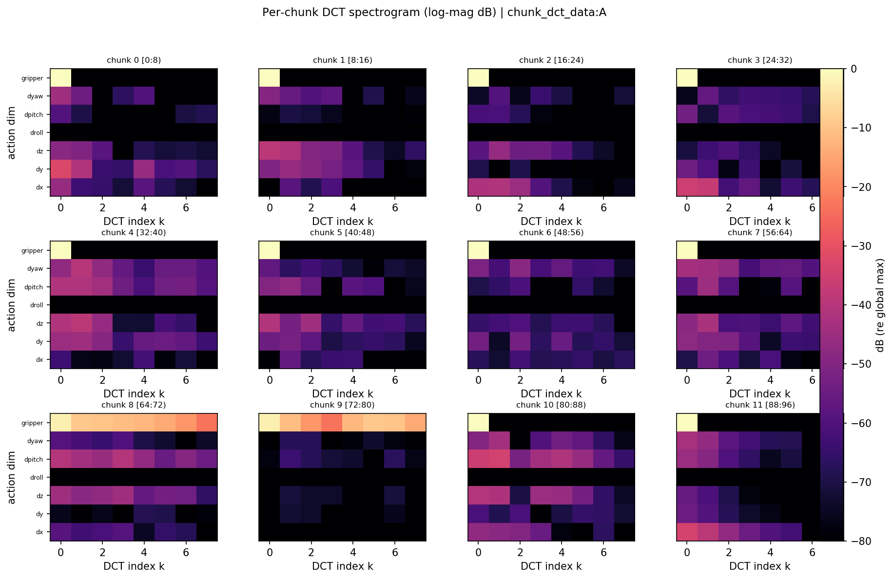
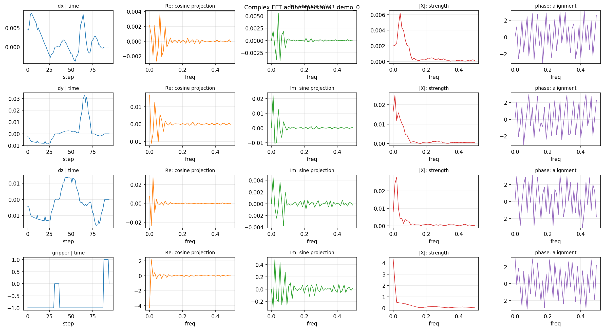
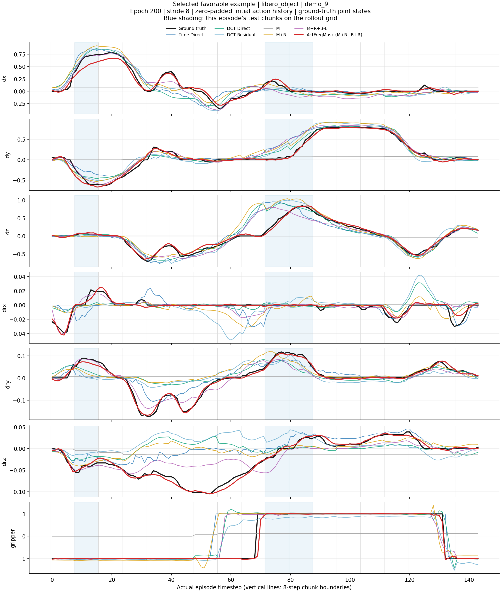

# ActFreqMask

Masked inter-chunk spectral transition modeling for robot action prediction.

ActFreqMask 将相邻动作块之间的预测建模为频谱转移：通过 mask 选择性继承前一块的频谱，并以 residual 修正未来动作所需的变化。

## 项目状态（2026 年 9 月）

| 工作项 | 状态 |
| --- | --- |
| ActFreqMask 论文 | 已提交 ICASSP，等待评审结果 |
| 反馈式推理 Demo | 已提交，等待结果 |
| 代码公开 | 等待论文流程完成后开放 |
| FreqMask-VLA | 正在推进，将频谱掩码与残差转移机制接入 VLA 动作策略 |

## 三部分研究证据

### 1. 相邻动作块的频谱关系

第一个可视化将连续动作按固定长度划分为相邻动作块，并分别观察其 DCT 频谱。相邻块在低频区域通常呈现相近的结构，说明连续运动具有一定的频谱继承性；同时，不同块之间仍存在局部差异和非零残差，因此下一动作块不能简单复制前一块频谱，而需要同时建模**选择性继承**与**变化修正**。这正是 ActFreqMask 使用 mask 和 residual 进行结构化频谱转移的动机。

### 2. 将动作视为多通道离散时间信号

动作块由按时间排列的多维控制量组成，可以从多通道离散时间信号的角度进行分析。下面的 DCT 和 FFT 可视化分别展示块内频谱结构与整段动作信号的频率分解，为动作块间频谱转移建模提供直观依据。两类图是信号分析示例，不应单独作为预测精度或误差累积改善的统计结论。

#### 2.1 每个 T=8 动作块的 DCT 频谱

此图来自参考 NPZ 中的动作数组，共 96 步、7 个通道。以 **chunk size = 8、stride = 8** 划分为 12 个连续、不重叠的块，每个通道沿块内时间轴独立进行 DCT。

- **每个子图**：一个动作块。例如 `[0:8)` 对应第 0–7 步，`[8:16)` 对应第 8–15 步。
- **横轴**：DCT 频率编号 `k=0…7`。`k=0` 是 DC 分量，反映块内平均水平；编号越大，余弦基在块内变化越快。
- **纵轴**：7 个动作通道，图中标为 `dx, dy, dz, droll, dpitch, dyaw, gripper`。图展示动作指令序列，不应将曲线解释为绝对末端位姿轨迹。
- **颜色**：DCT 系数绝对值的相对分贝值，使用所有展示块、通道和频率中的最大幅值作为共同参考。0 dB 最亮，−80 dB 最暗；这是幅值显示，不保留系数符号。不同通道的数值尺度会影响亮度，不能直接把亮度比较解释为物理重要性比较。

**如何理解：**多个通道的较强分量集中在低频区域，提示动作在短窗口内具有较平缓的变化结构。夹爪在保持恒定指令的块中主要表现为 DC 分量；在 chunk 8、9 中出现明显的非零频率成分，说明对应块内夹爪信号发生了变化。相邻块也有不同的局部频谱分布，因此可以进一步研究哪些内容适合继承、哪些需要修正。

**与方法的关系：**这张图直观展示了研究频谱继承与变化的动机，但“相邻块相似”仍应由相似度和残差统计量验证。模型处理的是带符号的 DCT 系数，图中为了观察幅值才取绝对值。当前训练管线还会使用训练集统计量标准化动作；本参考图不应直接等同于训练时的输入可视化。

#### 2.2 Franka 动作序列的复数 FFT 分解

此图展示 `demo_0` 的 95 步动作序列，选取 `dx、dy、dz、gripper` 四个通道。根据配套保存数组核对，频谱由 **Hann 窗加权、未去均值、正交归一化的实输入 FFT（rFFT）** 得到。第一列显示加窗前的动作，后四列显示加窗后序列的频谱。

| 列 | 含义 | 读图方式 |
| --- | --- | --- |
| time | 动作随时间步变化 | 观察平缓段、方向变化和夹爪切换 |
| Re | FFT 实部，余弦投影 | 有正负号，不是单独的能量大小 |
| Im | FFT 虚部 | 在标准 FFT 定义中对应负正弦投影 |
| magnitude | 幅值 `abs(X)` | 比较各频率成分的强弱 |
| phase | 相位 `angle(X)`，单位为弧度 | 描述相对于分析窗口起点的相位；低幅值频点的相位不宜过度解读 |

FFT 横轴 `freq` 的单位是 **cycles/step**，最高为 0.5，即奈奎斯特频率；没有代入实际采样率，因此不是 Hz。

**如何理解：**平移动作的较强幅值主要出现在低频，说明该例的主要变化尺度较缓慢；夹爪切换则在多个频率上产生响应。相位曲线的跳变也可能来自相位在 `[-π, π]` 范围内的折返，不能把它直接解释成动作抖动。由于频谱没有去均值且使用 Hann 窗，低频部分还受到平均水平和窗函数影响。

**与方法的关系：**FFT 图用于解释动作作为多通道信号的频率结构。ActFreqMask 当前的模型变换采用 DCT，并不使用这张图里的复数 FFT 实部、虚部或相位作为输入。

### 3. 迭代反馈式动作块预测

下图展示所有方法在同一个测试 episode 上的反馈式推理结果。动作块长度为 8；初始动作历史采用零填充，关节状态使用测试轨迹中的真实观测。每次预测得到的动作块都会作为下一次预测的动作历史，形成

`A_1 -> A_hat_2 -> A_hat_3 -> A_hat_4 -> ...`

的递归反馈过程，直至 episode 结束。蓝色阴影标记动作块边界，黑线为真实动作，其他曲线为不同方法的预测结果。该设置将单步预测误差放入连续反馈回路中，用于观察误差传播和长期轨迹偏移，而不仅是评估一次独立的下一块预测。

在该示例中，红色曲线 ActFreqMask 在主要运动转折和夹爪状态变化处整体更贴近真实轨迹，并在后续动作块中保持较小的偏移，体现出较好的反馈稳定性。由于这里展示的是一个具有代表性的单 episode 可视化，图中结论主要用于说明反馈行为；模型优劣仍应以所有测试 episode 的 MSE、MAE、Macro-F1 及频谱指标为准。

**如何理解：**反馈测试关注的是误差是否会在动作块递归输入后持续放大。若某个方法早期出现偏差，后续预测会以该偏差动作作为历史，因而可能产生逐步漂移；ActFreqMask 通过继承前一动作频谱的稳定成分，并使用残差修正变化成分，旨在减轻这种误差传播。

### 图像来源与实现核对

- DCT 图：`ref_npz_chunk_per_chunk_spectrum.png`；配套本地数据为 `ref_npz_chunk_data.npz`，动作形状为 `96 × 7`，DCT 数组形状为 `12 × 8 × 7`。
- FFT 图：`franka_task1_filter_demo0_complex_fft_components.png`；配套本地数据为 `franka_task1_filter_demo0_complex_data.npz`，动作形状为 `95 × 7`，rFFT 数组形状为 `48 × 7`。
- 反馈图：`feedback-rollout.png`，展示单个 LIBERO episode 的迭代反馈可视化；图中标题标注为 selected favorable example，因此不替代跨 episode 的汇总统计。
- 本次上传包含三张可视化图片与说明；上述配套数组未包含在本仓库中。
